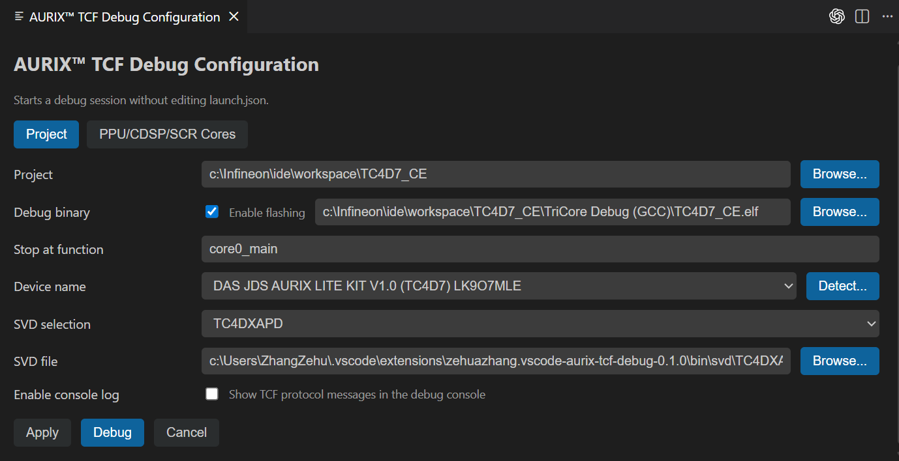

# AURIX&trade; TCF Debugger for VS Code

VS Code extension for debugging Infineon AURIX&trade; devices. It supports all AURIX&trade; TC2x, TC3x, and TC4x microcontrollers. 

## Features

- Multi-core debugging
- Line breakpoints and instruction/address breakpoints
- Step in/out, step over, continue/pause, restart, terminate
- Peripheral view (read and write SVD registers)
- Reset and halt at first breakpoint
- Call stack and variables
- Live watch of global variable
- Disassembly view
- Instruction stepping mode 
- Memory Inspector (read and write memeory)
- Launch configuration with AURIX&trade; device detect button
- Integrate AURIX&trade; Flasher

## Requirements

- Visual Studio Code 1.79.0 or higher
- DAS 8.3.0.1
- Peripheral Inspector extension (installed automatically as a dependency)
- Memory Inspector extension (installed automatically as a dependency)

## Connectivity and agent compatibility

Plug-and-debug: AURIX&trade; boards can be debugged in seconds — just connect the board over USB and select the detected target.

This extension uses the same TCF-based agent infrastructure used by AURIX&trade; Development Studio (ADS) and AURIX&trade; Configuration Studio (ACS). 

## Installation

### Install from VSIX

1. Download the `.vsix` file
2. Open the Extensions view by selecting the Extensions icon in the Activity Bar, or use the (`Ctrl+Shift+X`) keyboard shortcut.
3. Click `...` and choose "Install from VSIX..."
4. Select the `.vsix` file
5. Open Command Palette and run `Developer: Reload Window`

## Usage

### Debug configuration (UI)

1. Open Command Palette and run `AURIX™ TCF: Open Debug Configuration`
2. Fill in the fields and save the configuration
3. Click `Debug` to start debugging



### Or create launch.json manually

Create `.vscode/launch.json`:

```json
{
  "version": "0.2.0",
  "configurations": [
    {
      "type": "aurix-tcf",
      "request": "launch",
      "name": "AURIX TCF Debug",
      "host": "127.0.0.1",
      "port": 1534,
      "autoStartAgent": true,
      "program": "${workspaceFolder}\\temp\\TC375_CE\\TriCore Debug (GCC)\\TC375_CE.elf",
      "targetDevice": "DAS JDS AURIX LITE KIT V2.0 (TC375) LK8PIMU6",
      "entryFunction": "core0_main",
      "svdFile": "",
      "workspace": "${workspaceFolder}\\temp\\TC375_CE",
    }
  ]
}
```

### Start debugging

We suggest start debugging with `AURIX™ TCF: Open Debug Configuration`


### Watch global variables

Variables and expressions can be watched in the Run and Debug view's **WATCH** section.


### Live Watch View

The Live Watch view periodically refreshes selected global variables. Use the view's Settings button to configure the refresh interval (the minimum enforced value is 200 ms).

Once configured, the active interval appears in the view header (highlighted in orange). Resume the target to run the cores and observe the selected global variables update automatically.


### Peripheral View

This Peripheral View depends on the extension `mcu-debug.peripheral-viewer`. A SVD file is needed to enable this view and to keep it in sync with the target.


### Memory Inspector

The extension depends on `eclipse-cdt.memory-inspector`. Use the Command Palette and run
`Memory Inspector: Show Memory Inspector` to open the view, then enter an
address or expression once the target is paused.


### Disassembly View & Instruction Stepping Mode

The disassembly view opens automatically side-by-side with the source code and stays synchronized with the currently selected frame. The toolbar includes an `Enable Instruction Stepping` button, which allows stepping through the program's disassembly instructions. 


**Note:** If the `Enable Instruction Stepping` icon is grayed out, it indicates that instruction stepping is already enabled. To switch back to source code stepping, click the icon `Disable Instruction Stepping` again to disable instruction stepping.


Instruction breakpoints can be set in the same way as in the source code.

If the disassembly view is closed, use the Command Palette and run `Open Disassembly View` to open the view


## License

MIT License - see `LICENSE`
